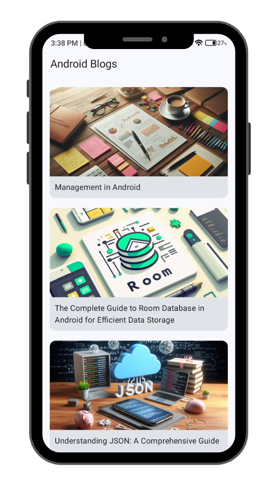

# 📚 Android Blogs App

This is a **beginner-friendly Android blog app** built using **Jetpack Compose**. The app fetches blog data from a GitHub repository (used as a free backend) and displays them in a well-formatted and responsive UI. Blogs are written in **Markdown** and rendered beautifully in the app. The app also supports **offline access** using Room database.

## ✨ Features

- 📰 View blog list with image thumbnails
- 📖 Read blog content formatted with Markdown
- 🔄 Smooth shimmer effect during loading
- 📡 Fetch blogs remotely from GitHub
- 💾 Offline support using local Room database
- 🌙 Works in light and dark mode
- 📅 Blogs are updated without any app update

> This is **not a static app**. Blog content is dynamic and can be updated remotely via GitHub without changing the app codebase.

---
# :camera_flash: **Screenshots**

| Blog List Screen                  | Blog Content Screen               |
|-----------------------------------|-----------------------------------|
|  |   |

## 🛠️ Built With

- **Jetpack Compose** – for modern UI
- **Ktor Client** – for network calls
- **Koin** – for Dependency Injection
- **Room** – for local database and offline access
- **Coil** – for image loading
- **Markdown Processor** – for rendering blog content
- **GitHub** – used as a backend server (stores blog metadata and markdown files)

---

## 📂 Project Structure

📁 data/  
│ ├── remote/ # Ktor client, DTOs, and remote data source  
│ ├── local/ # Room setup, entities, DAO  
│ └── repository/ # Repository implementation  
📁 domain/ # Domain models and Repository interfaces  
📁 presentation/ # UI components and ViewModels  

---

## 📡 Blog Data Source

All blog content is stored in this repository under:
- [`blogs/`](https://github.com/CodeInKotLang/AndroidBlogs-Server/tree/main/blogs) – Contains `.md` Markdown files for blog content
- [`images/`](https://github.com/CodeInKotLang/AndroidBlogs-Server/tree/main/images) – Stores images used in the blogs.

You can easily add more blogs by:
1. Writing a new blog in Markdown (`.md`)
2. Uploading it to the `blogs/` folder
3. Updating the `blogs.json` file with the blog details

---

## ▶️ Tutorial Playlist

📺 Follow the complete step-by-step playlist to build this app from scratch:

🔗 [Watch on YouTube (15-part series)](https://youtube.com/playlist?list=PL1b73-6UjePBW_toAR1FBCmqPK6UudwMX&si=dIMeVmZhtNcWlgaL)

# :memo: Author :memo:
- [Mohammad Arif](https://github.com/CodeInKotLang)

Check out my Udemy Courses: 
- 📚 [Android Quiz App: Ktor Backend & Jetpack Compose](https://www.udemy.com/course/quiztime/?referralCode=D1F5E08155303110B7A4)  
- 📚 [Android Fitness App: Firebase & Jetpack Compose](https://www.udemy.com/course/measuremate/?referralCode=B3DE352F96BC3C3E9E80)  
 

Happy learning and building amazing Android apps!
